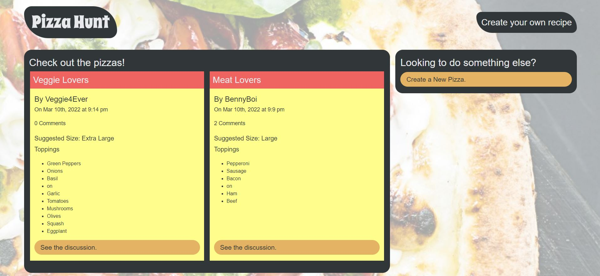
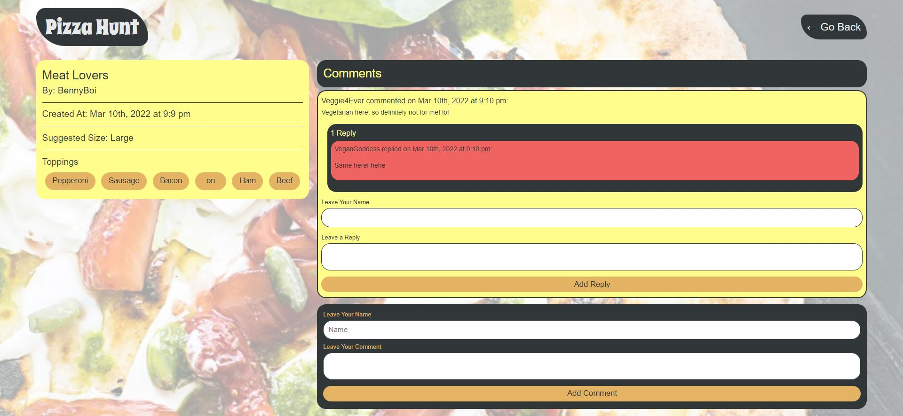

# Pizza Hunt

## Description
A simple and fun food blog site where users can share their favorite pizza combinations, view others' favorites, and engage in discussions about pizza!

## **Table of Contents**
* [Screenshots](#screenshots)
* [Programs](#programs)
* [Usage](#usage)
* [Website](#website)
* [Questions](#questions)

## **Screenshots**

## **Programs**
* CSS
* Heroku
* HTML
* IndexedDB
* JavaScript
* MongoDB
* MongoDB Atlas
* Mongoose
* Node.js
* NoSQL

## **Usage**
1. To submit a recipe, click 'Create a New Pizza' on the homepage
    * Give it a fun name!
    * Add your name or username to claim credit for your beautiful work
    * Choose your pizza size
    * Choose your toppings
    * Add a topping if you don't see it onl the list
    * Submit!
2. To comment and read about other people's recipes, click the 'See the discussion' button inside one of the recipe cards on the homepage
3. Get inspired to try a combo you may never have thought of!

## **Website**
[Pizza Hunt](https://shielded-reef-75732.herokuapp.com/)

## **Questions**
Please contact me directly with any additional questions:
* [GitHub](https://github.com/ChristopherLawn)
* [Email](mailto:christopher.d.lawn@gmail.com)